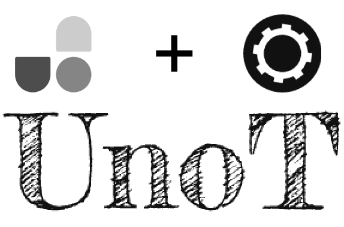

  

 English | <a href="./README_zh.md">简体中文</a>

UnoT 是 unocss tools 的简写，它是为了在vscode中使用unocss提供更加好的开发体验. 它集成了 [tounocss](https://github.com/Simon-He95/tounocss), [unocss to css](https://github.com/Simon-He95/unocss-to-css), [vscode uno magic](https://github.com/Simon-He95/vscode-uno-magic)

## :coffee:

[buy me a cup of coffee](https://github.com/Simon-He95/sponsor)

## License

[MIT](./license)
