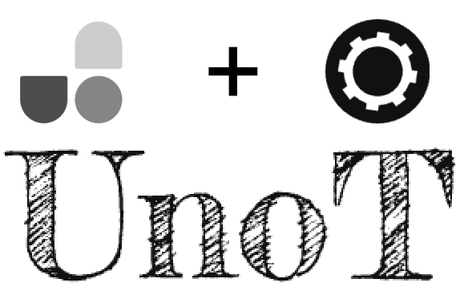

 <a href="./README.md">English</a> | 简体中文

UnoT is short for unocss tools that is to provide a better development experience using unocss in vscode. It integrated [tounocss](https://github.com/Simon-He95/tounocss), [unocss to css](https://github.com/Simon-He95/unocss-to-css), [vscode uno magic](https://github.com/Simon-He95/vscode-uno-magic)

## :coffee:

[请我喝一杯咖啡](https://github.com/Simon-He95/sponsor)

## License

[MIT](./license)
